# Tutorial APAP
## Authors
* **Fivi Melinda fivi.melinda** - *1706984594* - *APAP-C*

##Jawaban Pertanyaan Tutorial 2:
1. Cobalah untuk menambahkan sebuah restoran dengan mengakses link berikut:
 http://localhost:8080/restoran/add?idRestoran=1&nama=PanyuFC&alamat=Kantin%20Fasilkom&nomorTelepon=14022
 Apa yang terjadi? Jelaskan mengapa hal tersebut dapat terjadi.
 Terjadi error, karena template untuk add restoran belum ada
2. Pertanyaan 2: Cobalah untuk menambahkan sebuah restoran dengan mengakses link berikut:
 http://localhost:8080/restoran/add?idRestoran=2&nama=KentukuFC&alamat=Kantin%20FIK
 Apa yang terjadi? Jelaskan mengapa hal tersebut dapat terjadi
 Terjadi error, restoran tidak dapat ditambahkan karena parameternya tidak lengkap yaitu tidak ada value untuk nomor telepon
3. Jika Papa APAP ingin melihat restoran PanyuFC, link apa yang harus
diakses?
 http://localhost:8080/restoran/view?idRestoran=1
4. Tambahkan 1 contoh restoran lainnya sesukamu. Lalu cobalah untuk mengakses http://localhost:8080/restoran/viewall, apa yang akan ditampilkan? Sertakan juga bukti screenshotmu.
 Ditampilkan informasi semua restoran yang telah ditambahkan.
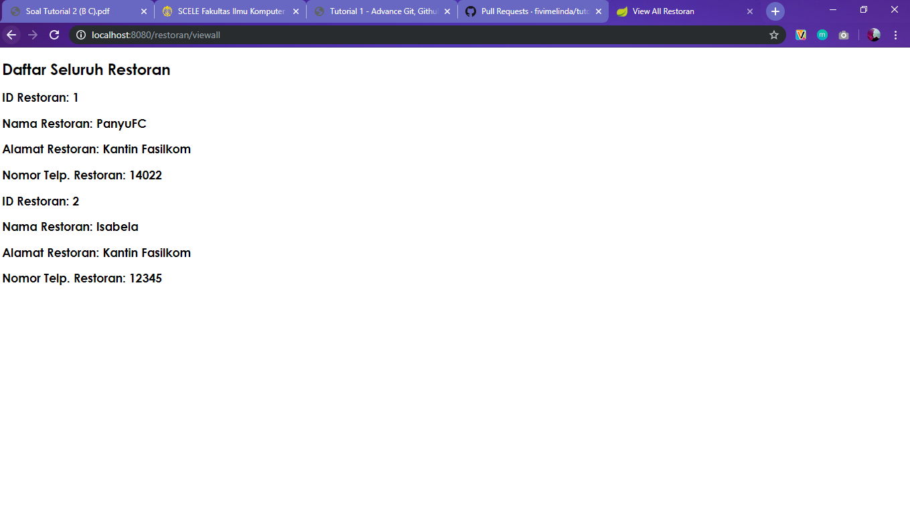

##Jawaban Pertanyaan Tutorial 3:
1. Method findByRestoranIdRestoran digunakan untuk mencari semua menu yang ada di menuDb dengan yang ID restorannya sesuai dengan parameter yang diberikan
2. addRestoranFormPage digunakan untuk memanggil model yang akan diisi di halaman html, sedangkan addRestoranSubmit digunakan untuk menyimpan model yang telah diisi ke dalam database.
3. JPA adalah cara untuk mempertahankan objek ke dalam relational database. JPA memiliki 2 bagian yaitu subsistem untuk memetakan class ke tabel relasional dan subsistem untuk mengelola entity seperti mengakses objek, menjalankan query dan lain-lain.
4. Di class MenuModel saat mendefinisikan atribut restoran disebutkan annotation ManyToOne, dan di class RestoranModel saat mendefinisikan atribut listMenu disebutkan annotation OneToMany. Artinya relasi antara restoran dan menu adalah 1 restoran dapat memiliki banyak menu dan tiap menu dimiliki 1 restoran.
5. FetchType.EAGER akan meminta Hibernate mendapatkan semua elemen relasinya ketika mengambil root entity (default untuk relasi to-one). Sedangkan FetchType.LAZY hanya akan menginisiasi dan meload data yang diminta ke dalam memory ketika dipanggil secara eksplisit (default untuk relasi to-many).   JPA menyediakan javax.persistence.CascadeType untuk membangun dependency sehingga ketika suatu operasi diterapkan pada sebuah entity, operasi tersebut akan berlaku untuk entity lain juga yang terkait dengannya. Untuk CascadeType.ALL maka akan diberlakukan semua operasi cascade (PERSIST, MERGE, DETACH, REFRESH, REMOVE) pada entity yang terkait dengan parent entity.

##Jawaban Pertanyaan Tutorial 4:
1. Pada nomer 2 dipelajari bagaimana menerapkan aspek dinamis pada fragment. Tahapan yang dilakukan yaitu pada fragment.html di dalam tag nav untuk th:fragment valuenya menjadi "navbar (brand)". Kemudian di dalam tag a ditambahkan "th:text="${brand}". value brand ini nantinya akan digantikan sesuai nilai brand yang diisikan di halaman html. Misal pada home.html dalam tag nav dituliskan "(brand='Home')" maka nantinya tulisan yang muncul di navbar adalah "Home".
2. Pada nomor 3 dipelajari bagaimana meng-handle input multiple yaitu dapat melakukan delete dan insert dalam banyak row untuk menu sekaligus. Tahapan yang dilakukan yaitu  menambahkan method-method di menu controller untuk menambah row, menghapus row, dan submit/menyimpan menu yang telah diisikan. Kemudian pada form-add-menu.html membuat tabel dan menambahkan input field, serta menambahkan tombol add row dan hapus seperti pada view-restoran.html
3. `
 content here 
` artinya fragment akan dimasukkan dalam tag  
`
 content here 
` artinya fragment akan digantikan oleh content.
4. contoh penggunaan  
`<form th:action="@{/restoran/add}" th:object="${restoran}" method="POST">`  
th:object digunakan untuk menentukan objek tempat data akan diletakkan

##Jawaban Pertanyaan Tutorial 5:
1. given:   `RestoranModel myResto = generateDummyRestoranModel(1);`
 when:  `when(restoranService.getRestoranByIdRestoran((long)1)).thenReturn(Optional.of(myResto));` 
`mockMvc.perform(get("/restoran/view?idRestoran=1"))`
 then:
 `.andExpect(MockMvcResultMatchers.status().isOk())
		.andExpect(content().string(Matchers.containsString("Informasi Restoran")))
		.andExpect(content().string(Matchers.containsString("ID Restoran")))
		.andExpect(model().attribute("resto", is(myResto)));
		verify(restoranService, times(1)).getRestoranByIdRestoran(1L);`

2. Line coverage adalah jumlah baris/statement yang dieksekusi pada test.
  Sedangkan Logic coverage memeriksa semua kemungkinan yang terjadi (true atau false), untuk setiap kondisi minimal diperiksa satu kali.
3. Unit test terlebih dahulu, karena dari test kita bisa mengetahui apa saja kemungkinan yang akan terjadi pada code yang kita buat sehingga dapat mencegah adanya error. Selain itu dengan menulis test terlebih dahulu kita jadi tahu apa saja yang diharapkan dapat dikerjakan code yang kita buat sehingga akan menghindari feature creep. Sedangkan bila dibuat code terlebih dahulu, akan ada kemungkinan ketika dilakukan test masih terdapat error atau ada fitur yang terlewat sehingga code harus diperbaiki kembali, atau juga mengalami feature creep.
 COVERAGE:
 Sebelum menambahkan Test untuk MenuService
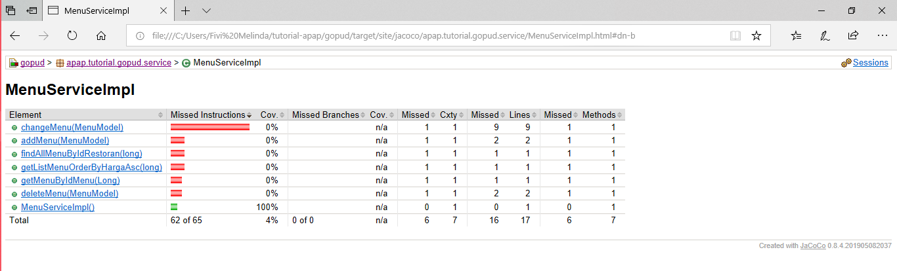
 Setelah menambahkan Test untuk MenuService
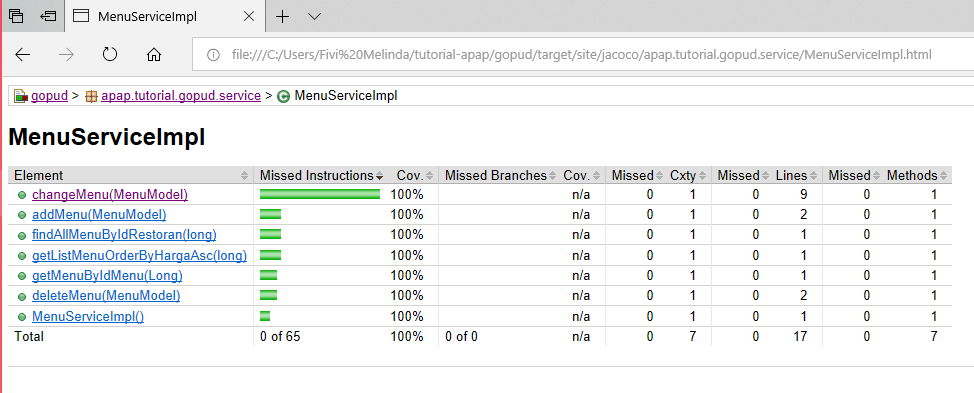
 Sebelum menambahkan Test untuk view restoran by Id
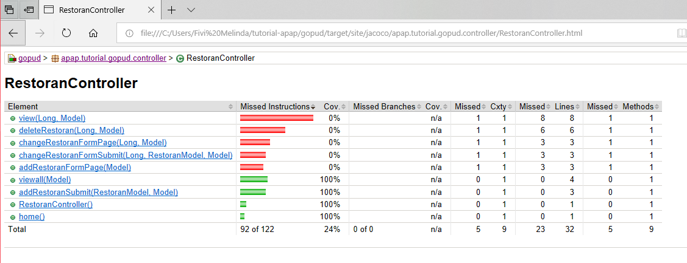
 Setelah menambahkan Test untuk view restoran by Id
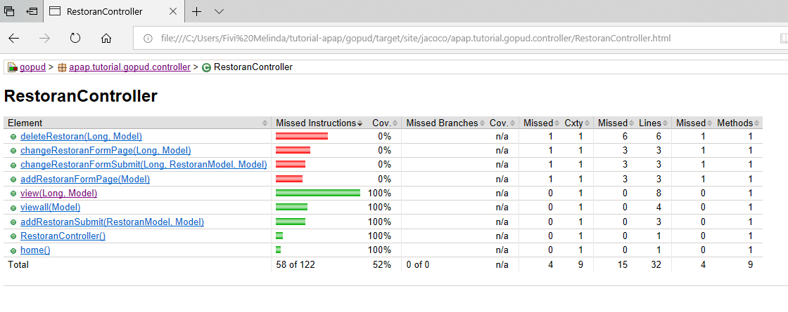

##Jawaban Tutorial 6:
1. Postman adalah aplikasi untuk browser chrome yang berfungsi sebagai REST Client atau aplikasi yang digunakan untuk uji coba API yang telah dibuat. Fungsi utama postman ini adalah sebagai GUI API Caller namun sekarang postman juga menyadiakan fitur lain yaitu Sharing Collection API for Documentation (free), Testing API (free), Realtime Collaboration Team (paid), Monitoring API (paid), Integration (paid).
2. Anotasi JsonIgnoreProperties dapat digunakan untuk menekan serialisasi properti (selama serialisasi), atau mengabaikan pemrosesan properti JSON yang dibaca (saat deserialisasi).
3. ResponseEntity mewakili seluruh respons HTTP: kode status, header, dan body. Karena itu, kita dapat menggunakannya untuk mengkonfigurasi respons HTTP sepenuhnya.

##Jawaban Tutorial 7:
1. Otentikasi adalah proses membuktikan keaslian pengakses atau mencocokan data seorang dengan data yang telah tersimpan di dalam database dengan tujuan untuk memvalidasi data pengakses apakah benar pengguna tersebut adalah pengguna yang mempunyai akses untuk masuk ke dalam sistem. Otorisasi adalah proses penentukan hak akses layanan apa saja yang kita terima setelah identitas kita terverifikasi. Contoh otentikasi dilakukan dengan adanya fitur login yang dijalankan dengan method configAuthentication pada class WebSecurityConfig. Sedangkan otorisasi dilakukan method configure, contoh pada baris code `.antMatchers("/user/addUser").hasAnyAuthority("ADMIN")` artinya url /user/addUser hanya dapat diakses oleh admin.
2. BCryptPasswordEncoder adalah passsword hashing function. BCrypt secara internal akan menghasilkan bentuk random salt sebagai ganti dari bentuk asli password. Setiap kali dipanggil hasil enkripsi akan berbeda sehingga hanya perlu melakukan enkripsi satu kali. Algoritma BCrypt ini menghasilkan String sepanjang 60 karakter.
3. UUID mewakili pengidentifikasi unik universal yang tidak dapat diubah dengan nilai 128 bit terdiri dari 36 karakter alphanumerik dan 4 karakter tanda strip. Digunakan untuk membuat ID session di aplikasi web. Pada UserModel uuid dapat secara otomatis mengamankan data user, karena memiliki karakter unik universal sehingga tidak akan ada id redundan.
4. UserDetailsServiceImpl ini digunakan untuk mengimplementasikan UserDetailsService yang diimport dari org.springframework.security.core yang berfungsi mengambil data terkait otorisasi dan otentikasi pengguna, memiliki satu metode loadUserByUsername() yang dapat diganti untuk menyesuaikan proses menemukan pengguna.

##Jawaban Tutorial 8:
1. Pada latihan 1 memberikan condition pada Item.js dimana checkbox dimunculkan jika 'checked' bernilai true sehingga checkbox hanya terdapat pada menu yang masuk list my favorite  
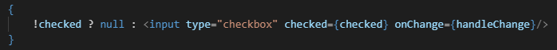
2. Pada latihan 2 mengubah fungsi handleItemClick sehingga tidak terdapat fungsi untuk menghilangkan item dari list, kemudian membuat fungsi baru handleItemClick_2 untuk menghapus item dari list favorite 
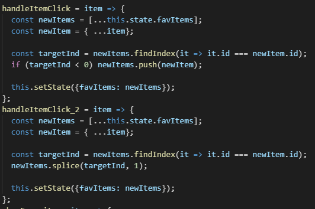  
Pada My favorite juga diubah fungsi yang dipanggil ketika di click menjadi handleItemClick_2 seperti berikut.  
`onItemClick={this.handleItemClick_2}`
3. Pada latihan 3 menambahkan `show :false` pada state di App.js. Show ini berfungsi menyimpan kondisi checkbox, ketika checkbox show favorite di check maka nilainya menjadi true. Hal tersebut di atur dengan menambah fungsi berikut  
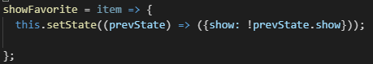 
  Fungsi di atas akan dipanggil ketika checkbox diclick. Selanjutnya ketika show bernilai true maka daftar menu favorite ditampilkan. Sebaliknya jika masih false menu favorite tidak ditampilkan  
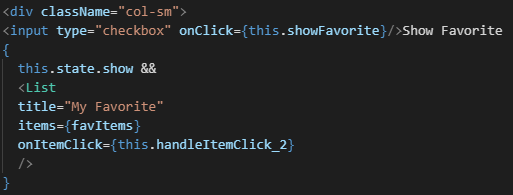
4. Pada latihan 4 membuat component EmptyState berisi kalimat yg akan ditampilkan jika list favorite kosong. Selanjutnya pada List.js membuat variabel content yang dipanggil dalam html. Kemudian diberikan condition jika items pada list kosong maka yang diassign sebagai variabel content adalah component EmptyState. Jika tidak kosong maka list items dimunculkan. 
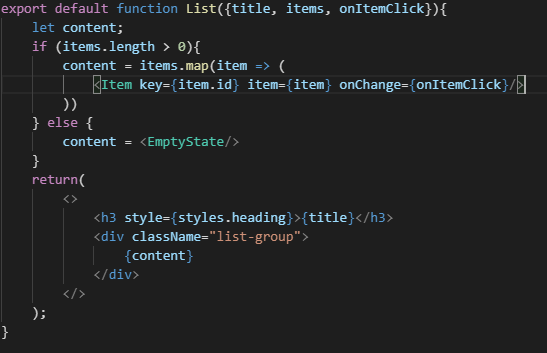

##Jawaban Tutorial 9:
1. Mengubah state nama, alamat, nomor telepon, dan rating restoran kosong kembali ketika menekan submit saat menambah atau mengedit restoran. Hal tersebut dilakukan agar ketika form dimunculkan kembali, maka nilai state sudah kosong sehingga input field menjadi kosong.
2. JavaScript bersifat non blocking atau tidak menunggu suatu fungsi selesai untuk melanjutkan ke fungsi yang lain. Solusinya yaitu dengan menerapkan async-await. Apabila pada suatu fungsi ditambahkan kata kunci async di depannya, maka fungsi tersebut akan selalu menghasilkan return dalam bentuk Promise. Selanjutnya di dalam fungsi async ini, digunakan await,  maka akan menunggu sampai promise tersebut resolved.
3. 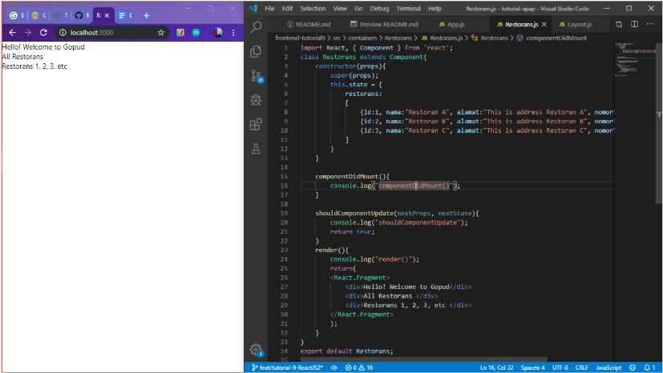
 
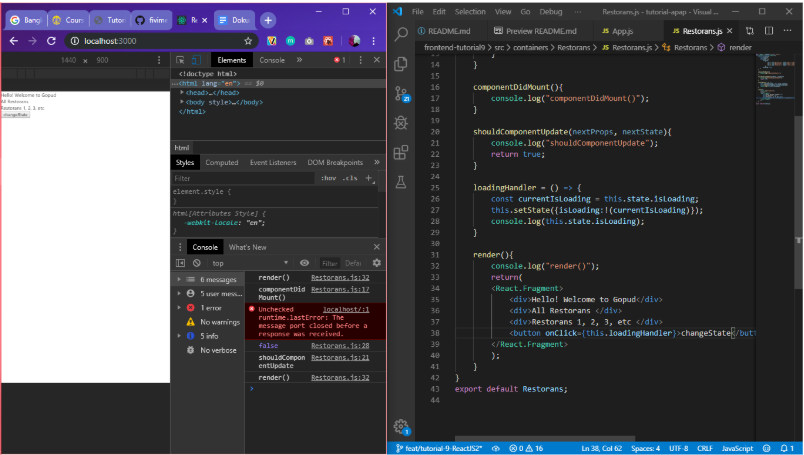

4. Fase Mounting adalah fase ketika components di buat atau pertama kali di render ke DOM. `componentWillMount` adalah method yang akan di eksekusi pertama kali, kemudian akan mengeksekusi method render. Setelah method render di eksekusi baru kemudian mengeksekusi method `componentDidMount`. Akses dan manipulasi DOM di lakukan pada method ini, operasi lain seperti request data dari API semuanya dilakukan di sini. Contoh penggunaan componentDidMount yaitu merequest data dari API menggunkan Axios.
  
Fase updating adalah fase ketika sebuah component akan di render ulang, biasanya ini terjadi ketika ada perubahan pada state atau props yang mengakibatkan perubahan DOM. 
 
`shouldComponentUpdate` : tugasnya adalah untuk menentukan apakah sebuah component akan di render ulang atau tidak. Method ini akan mengembalikan nilai boolean true & false, jika true maka component akan di render ulang atau sebaliknya.
 
`componentWillReceiveProps` : fungsi ini akan di eksekusi bila state yang ada di component akan di update atau di ubah dengan nilai props yang baru.
 
'componentDidUpdate` : fungsinya sama dengan componentDidMount yaitu untuk manipulasi DOM dan request data.
  
Fase unmounting adalah fase ketika component di hapus dari DOM. Pada fase ini hanya ada satu method yang akan di eksekusi yaitu `componentWillUnmount`, yang di jalankan sebelum sebuah component di hapus dari DOM.